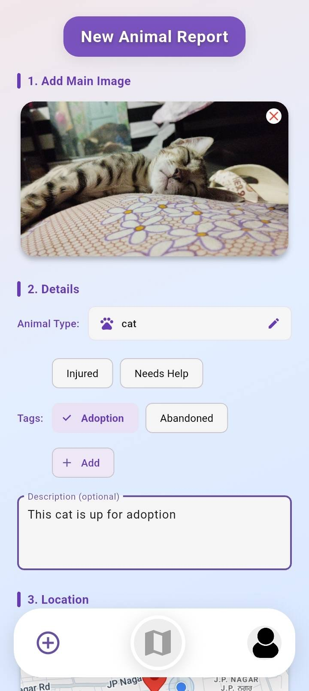
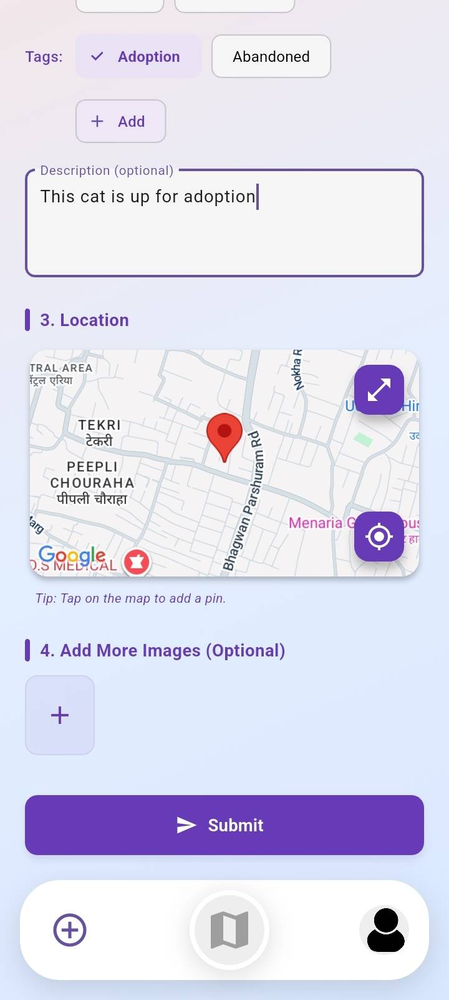
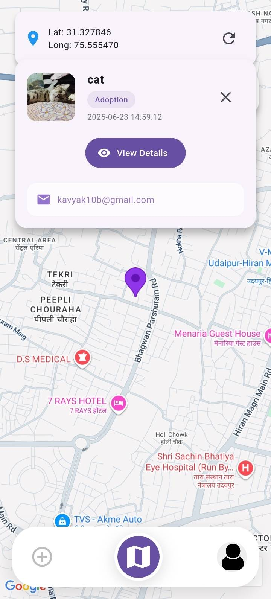
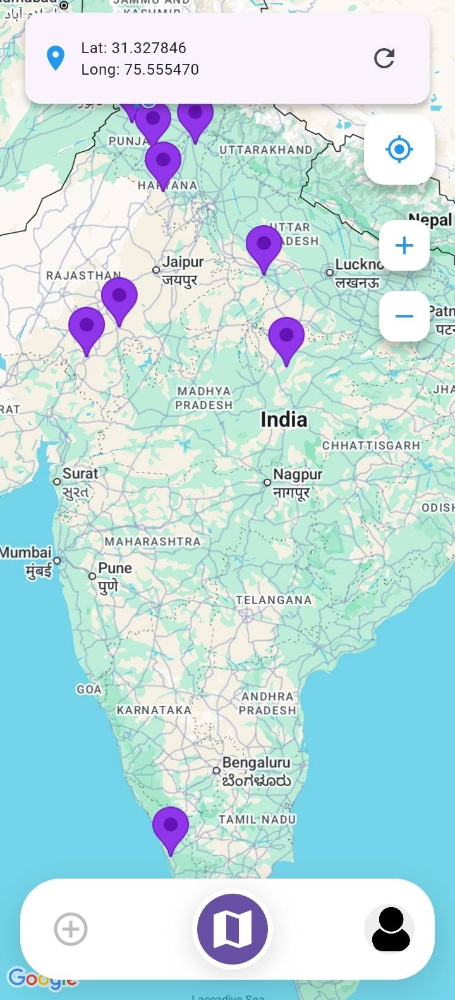
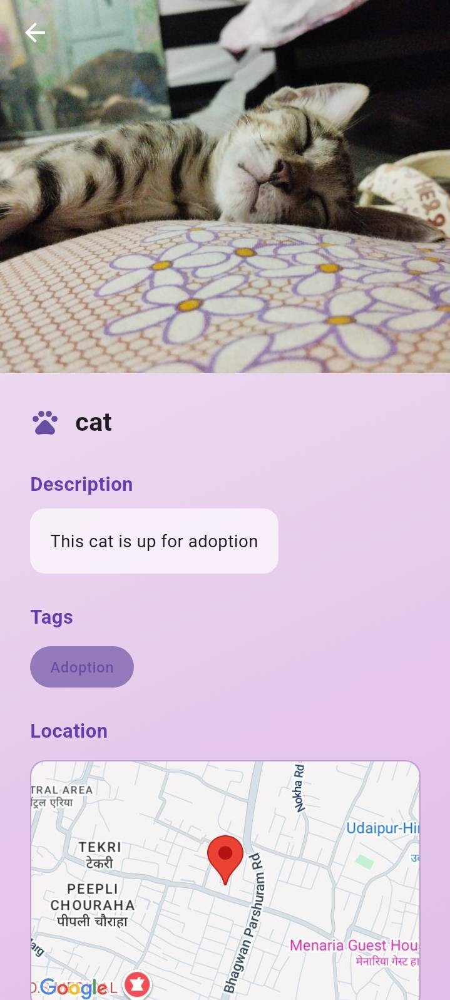
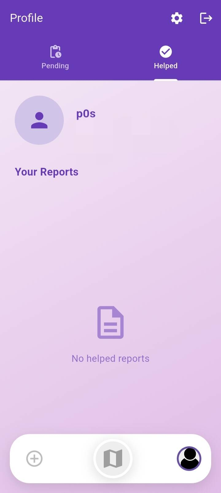
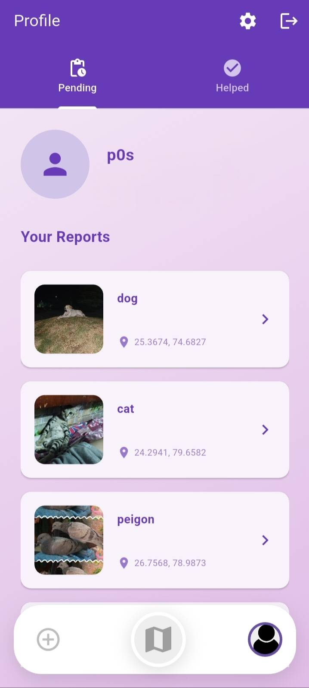
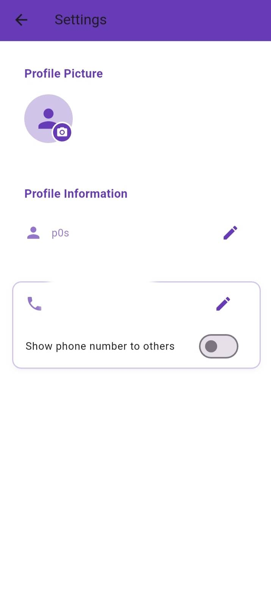

# ResQtail

## Overview
ResQtail is a cross-platform Flutter application designed for pet rescue and management. It empowers communities to report, locate, and help stray or injured animals efficiently.

## Features

- **Pet Rescue Reporting:** Easily report stray or injured animals by uploading images, tagging the situation (e.g., "Injured", "Needs Help", "Adoption", "Abandoned"), and providing a description.
- **Automatic Animal Detection:** Utilizes AI to automatically detect the type of animal in uploaded images, streamlining the reporting process.
- **Location Integration:** Geotags reports using your device's current location. View all reports on an interactive map to see where help is needed most.
- **User Authentication:** Secure registration and login with email verification and phone number validation for trusted community participation.
- **Profile Management:** Update your profile, including username, phone number, and profile picture. Control the visibility of your phone number for privacy.
- **Email Notifications:** Receive email verification and notifications powered by SMTP integration.
- **Multi-Platform Support:** Available for Android, iOS, web, Windows, macOS, and Linux.

## Screenshots

<!-- Report Screens -->

<table>
  <tr>
    <td align="center">
      
    </td>
    <td align="center">
      
    </td>
  </tr>
  <tr>
    <td colspan="2" align="center"><b>Report Screen</b></td>
  </tr>
</table>

<!-- Map Screens -->

<table>
  <tr>
    <td align="center">
      
    </td>
    <td align="center">
      
    </td>
    <td align="center">
      
    </td>
  </tr>
  <tr>
    <td colspan="3" align="center"><b>Map Screen with View Details</b></td>
  </tr>
</table>

<!-- Profile Screens -->

<table>
  <tr>
    <td align="center">
      
    </td>
    <td align="center">
      
    </td>
    <td align="center">
      
    </td>
  </tr>
  <tr>
    <td colspan="3" align="center"><b>Profile Screen</b></td>
  </tr>
</table>

## How It Works
1. **Sign Up & Verify:** Register with your email and phone number, then verify your email.
2. **Report an Animal:** Upload a photo, let the app detect the animal, add tags and a description, and submit the report with your location.
3. **View Reports:** Browse and filter reports on an interactive map to find animals in need nearby.
4. **Profile Management:** Update your details and control your privacy settings.

## Download

You can download the latest version of the app from the [Releases](https://github.com/your-repo/releases) tab.

## Contributing
Contributions are welcome! Please open an issue or submit a pull request for any improvements or bug fixes.

## License
This project is licensed under the terms of the [MIT License](LICENSE).

---

For more information, please refer to the in-app help or contact the project maintainers.
